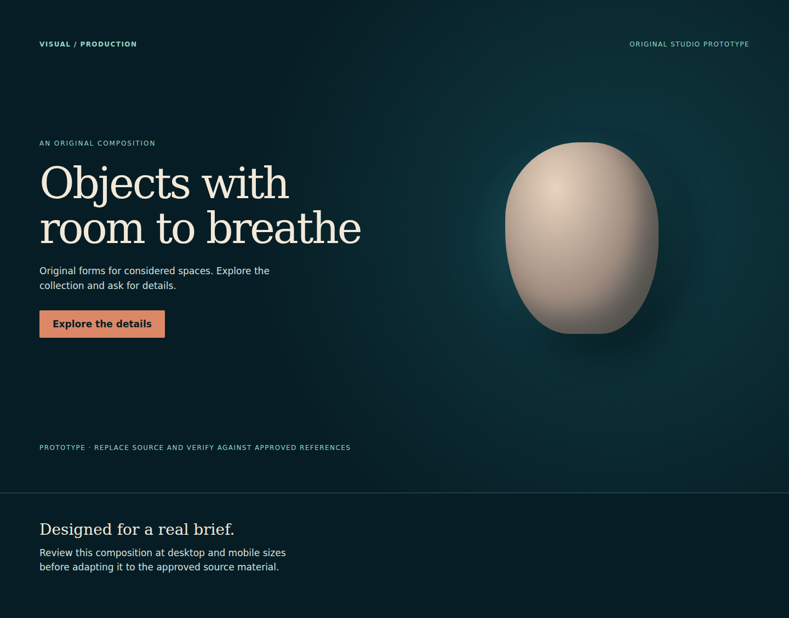
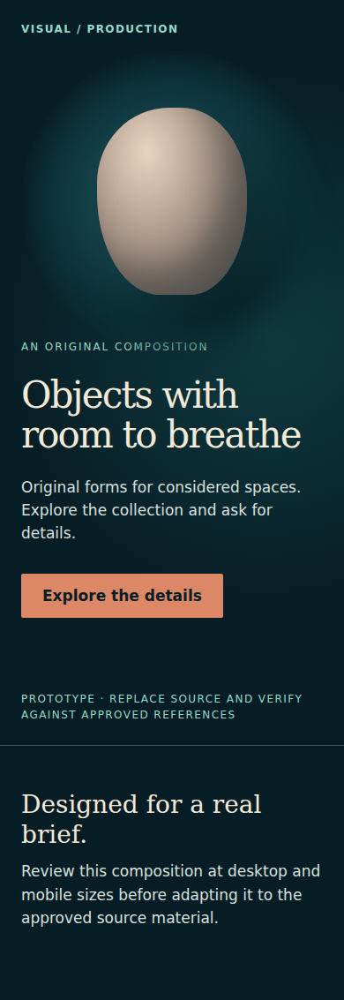

# Motion prototype browser proof

Captured from the checked-in `demo/motion.html` with the isolated Linux render environment. The [verification report](motion-verification.json) records the source SHA-256, library versions, viewport/document widths, CTA results and runtime errors.

All nine checks passed: 1440, 390 and 320 pixels in normal, reduced-motion and offline modes. Normal and reduced-motion captures use the exact pinned npm libraries at their declared script URLs, not live CDN responses. Offline captures intentionally abort both script requests; their expected network failures are recorded separately. No page runtime errors occurred. Each CTA reached the existing details section, and every layout remained within its viewport.

| Mode | Desktop | Phone | Narrow phone |
| --- | --- | --- | --- |
| Motion | [1440](motion-motion-1440.png) | [390](motion-motion-390.png) | [320](motion-motion-320.png) |
| Reduced motion | [1440](motion-reduced-1440.png) | [390](motion-reduced-390.png) | [320](motion-reduced-320.png) |
| Scripts unavailable | [1440](motion-offline-1440.png) | [390](motion-offline-390.png) | [320](motion-offline-320.png) |

This is a generic original fixture, not a customer result or proof of hosted subscription service.
